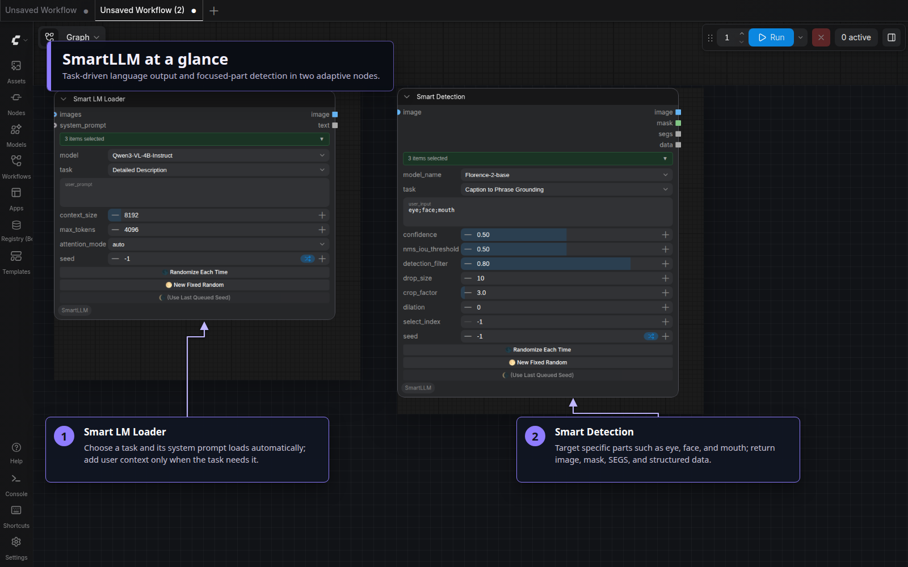
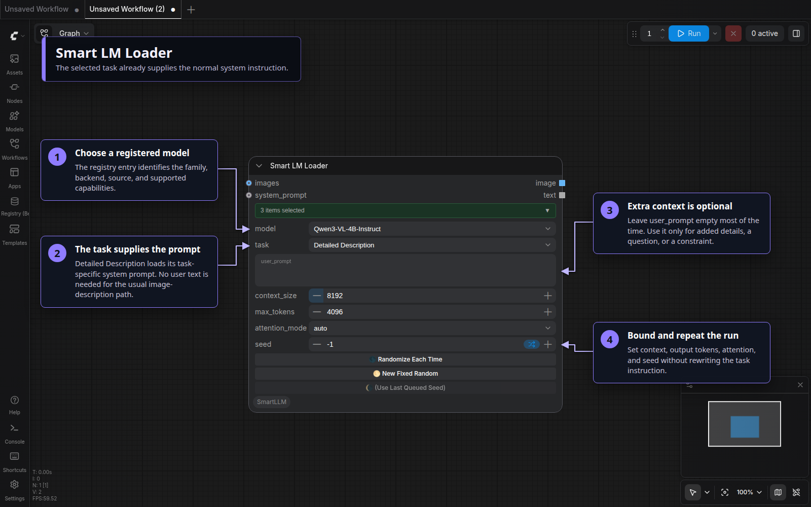
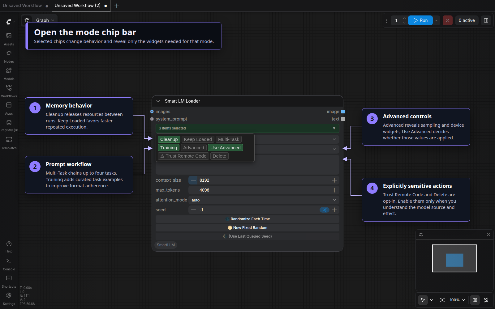
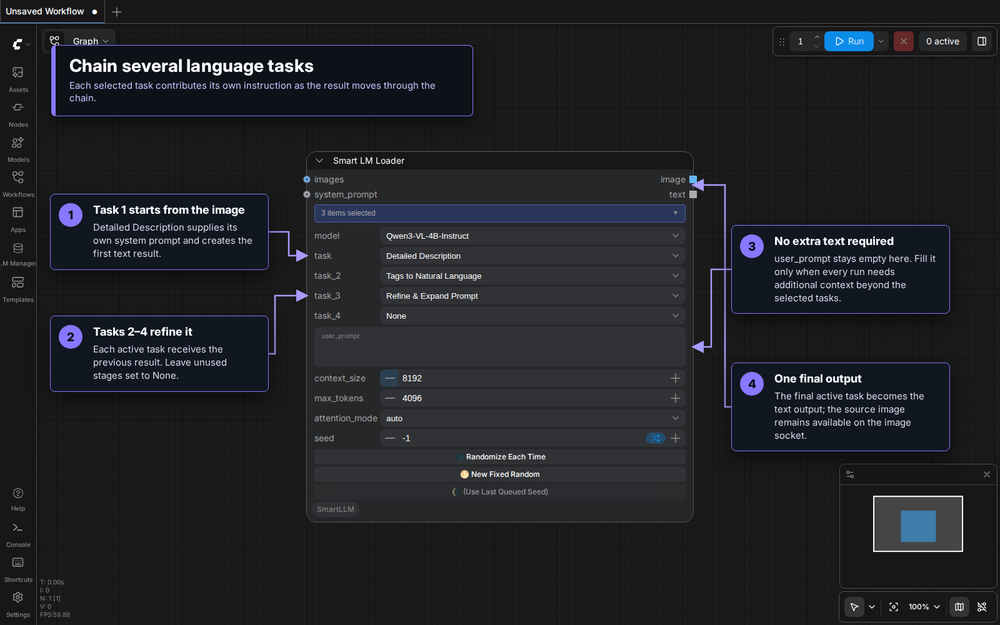
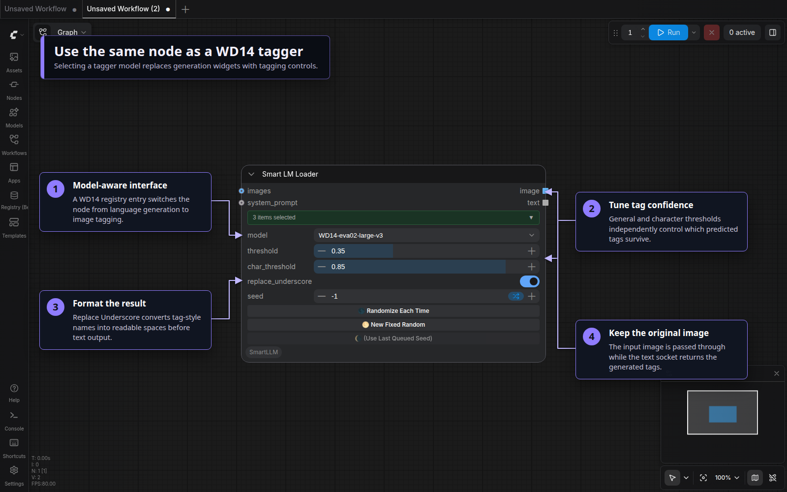
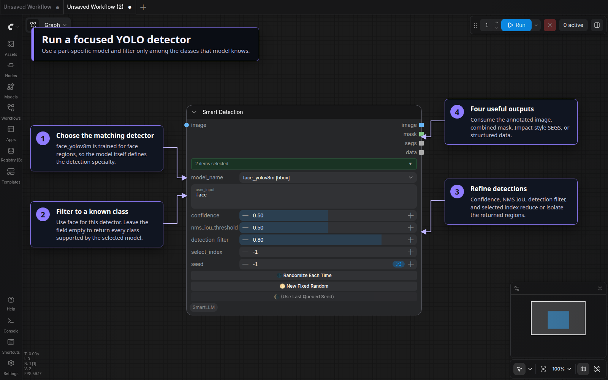
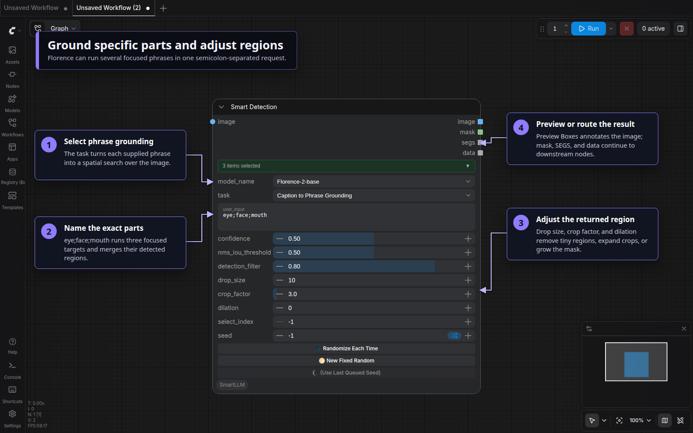
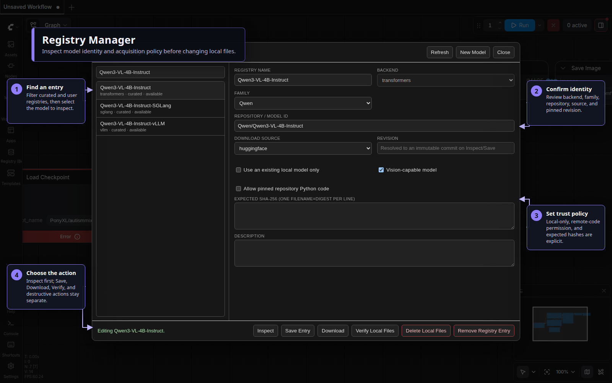

# ComfyUI SmartLLM

One adaptive interface for vision-language models, text models, WD14 taggers,
Florence grounding, and YOLO detection—plus a registry manager that keeps model
identity, acquisition, and trust decisions explicit.

Version **1.0.2** provides three Nodes 2.0-ready nodes. ComfyUI Eclipse is
optional.



## Why use it?

- **One language-model node** adapts to vision, text, and tagger families instead
  of exposing every backend control at once.
- **One detection node** covers Florence and Qwen grounding tasks alongside YOLO
  bounding-box and segmentation models.
- **A matching postprocessor** converts structured detections into selectable
  masks and SAM2-compatible bounding boxes without requiring Eclipse.
- **Several execution backends** share one registry-driven model selector,
  including Transformers, GGUF, Ollama, vLLM, SGLang, and llama.cpp.
- **Verified acquisition** records model source, immutable revision, integrity,
  and provenance before committing local files.
- **Workflow compatibility** preserves the historical `[Eclipse]` node IDs, so
  existing workflows load without node replacement.

## Visual tour

### Start with Smart LM Loader

Search for `Smart LM Loader [Eclipse]` in **Add Node**. Choose a registered
model, then select the task it should perform. The interface responds to the
model family: a vision model exposes image-aware tasks, while text-only and
tagger models show their relevant inputs.



The selected task loads its task-specific system prompt automatically, so
`user_prompt` is normally empty for tasks such as Detailed Description. Use it
only for additional information, a question, or constraints that are not already
expressed by the task. Connecting `system_prompt` is an explicit override: it
switches the node to Direct Chat and bypasses the default task prompt templates.
The connected text becomes the complete system instruction, so it must contain
every important role, objective, constraint, and output-format requirement.
`user_prompt` then supplies the user message or source material for that custom
instruction.

The image input is optional for text-only tasks. Output sockets return generated
text plus an image when the selected task supports one.

Some generative tasks intentionally use `user_prompt` as their source material:

- For a Wan or LTX image-to-video task, connect the starting image and describe
  the intended motion, action, dialogue, style, or camera behavior in
  `user_prompt`. The task prompt tells the model how to format the result; the
  image establishes visual details such as the person's appearance, while the
  user text explains what should happen in the video.
- For **Song Lyrics**, enter a short story, theme, mood, or song concept in
  `user_prompt`. Genre, language, tempo, or structural preferences can be added
  when they matter. The result is a structured lyric sheet that can be copied
  into Suno, Mureka, or another music-generation tool.

These cases do not require a custom `system_prompt`; selecting the task still
loads the appropriate instructions automatically.

### Open the mode chip bar

Click the green mode bar to change memory, prompt, advanced-runtime, trust, and
model-maintenance behavior. Selected chips are serialized with the workflow;
inactive sections stay hidden.



Available Smart LM modes are `Cleanup`, `Keep Loaded`, `Multi-Task`, `Training`,
`Advanced`, `Use Advanced`, `⚠ Trust Remote Code`, and `Delete`.

- `Cleanup` and `Keep Loaded` control the model lifecycle between executions.
- `Multi-Task` exposes a sequential task chain; `Training` adds curated
  task-specific examples to the prompt.
- `Advanced` reveals sampling, device, and compile controls. `Use Advanced`
  decides whether the advanced sampling values are applied.
- `⚠ Trust Remote Code` permits pinned repository Python code for the selected
  model. Enable it only for a source you trust.
- `Delete` reveals the separately confirmed local-file deletion action.

### Chain tasks in one execution

Enable `Multi-Task` to expose Task 2 through Task 4. Each active stage receives
the previous stage's text and passes its result forward. This is useful for a
visual description → prose conversion → prompt refinement sequence without
adding several model nodes.



Set unused stages to `None`. The final active stage becomes the node's text
output, while the image output remains available for compatible workflows.

### Switch to WD14 tagging

Selecting a WD14 registry entry replaces language-generation widgets with the
tagger's general threshold, character threshold, and underscore-formatting
controls.



Connect an image and consume the generated tags from the text socket. The image
socket passes the source image through for downstream routing.

### Run YOLO detection

Search for `Smart Detection [Eclipse]`, select a YOLO registry model, and
optionally filter among the classes that specific detector knows. For example,
the face-specific `face_yolov8m` model can use `face`; other registered models
specialize in regions such as eyes, faces, hands, or people. Detector-specific
confidence, NMS, filtering, and region-selection controls appear automatically.



The node returns an annotated image, a combined mask, Impact-compatible `SEGS`,
and structured detection data.

### Ground phrases and adjust regions

Florence and compatible Qwen models expose language-directed tasks such as
Caption to Phrase Grounding. Enter focused parts such as `eye;face;mouth`; the
semicolon-separated phrases are run as individual targets and their regions are
merged. Enable `Preview Boxes` to annotate the result and `Adjust` to reveal
drop-size, crop-factor, and dilation controls.



Smart Detection modes are `Cleanup`, `Keep Loaded`, `Preview Boxes`, `Adjust`,
`Advanced`, and `Delete`. The selected model and task determine which controls
are meaningful.

### Convert detection data to masks and boxes

Connect Smart Detection's `image` and `data` outputs to
`Detection to Bboxes [Eclipse]`. The converter accepts regular boxes, OCR quad
boxes, and polygons; it can combine them into one mask or return selected regions
separately, with optional inversion, grow/shrink, and blur processing. Its bbox
output uses the established `BBOXES` structure for downstream tools such as SAM2
Ultra.

The converter also has an independent image-analysis mode. Enable
`get_mask_from_image` to detect bright or color-channel regions directly with
threshold and minimum-area controls instead of consuming JSON data.

### Inspect and acquire models

Open **SmartLLM → Edit Smart LM Registry (Beta)**, use the **LM Registry**
left-toolbar launcher, or use the classic-menu button. Registry Manager separates
model identity and trust policy from each action you may take.



A registry entry can define its display name, backend, model family, repository
or model ID, source, immutable revision, vision capability, local-only policy,
remote-code permission, expected SHA-256 digests, and description.

Use **Inspect** before **Save Entry** or **Download**. **Verify Local Files** does
not download anything. **Delete Local Files** and **Remove Registry Entry** are
separate confirmed operations: removing an entry does not delete its local model
files.

## Included nodes

| Node | Inputs | Outputs | Purpose |
| --- | --- | --- | --- |
| `Smart LM Loader [Eclipse]` | optional images, optional system prompt, adaptive widgets | image, text | Run registered vision-language, text, or WD14 models |
| `Smart Detection [Eclipse]` | image, adaptive widgets | image, mask, SEGS, data | Run Florence/Qwen grounding or YOLO detection |
| `Detection to Bboxes [Eclipse]` | image, optional detection data, mask controls | mask, BBOXES | Convert Smart Detection data or image regions into masks and boxes |

The `[Eclipse]` suffixes are compatibility identifiers. SmartLLM owns all three
implementations and does not require Eclipse at runtime. The two model nodes
appear under **Smart LM Loader → Loader**, while the converter appears under
**Smart LM Loader → Conversion**. Their historical IDs remain unchanged so saved
workflows continue to resolve without node replacement.

## Supported backends and model families

| Path | Typical use |
| --- | --- |
| Transformers | Local Hugging Face vision-language and text models, including Qwen, Florence, Mistral, and LLaVA-family models |
| GGUF / llama.cpp | Quantized local language and vision-language execution |
| Ollama | Models served by an Ollama runtime |
| vLLM / native vLLM | High-throughput model serving, locally or through the managed Docker path |
| SGLang | Structured high-throughput model serving |
| WD14 | Image tagging with independent general and character thresholds |
| YOLO | Bounding-box and segmentation detection |

Backend availability depends on the optional packages or services installed in
your ComfyUI environment. The base installation does not force every compiled
runtime onto the user.

## Installation

### ComfyUI Manager

Search for **ComfyUI SmartLLM**, install it, and restart ComfyUI.

### Manual

From your ComfyUI installation:

```bash
cd custom_nodes
git clone https://github.com/r-vage/ComfyUI_SmartLLM.git
cd ComfyUI_SmartLLM
python -m pip install -r requirements.txt
```

Restart ComfyUI, then search Add Node for any included node. User-facing
settings appear under **Smart LM Loader → Configuration** and retain stable
`SmartLLM.*` IDs.

Install compiled or backend-specific integrations only when needed:

```bash
python -m pip install -e ".[sml]"
```

Docker backends require Docker separately. See the
[general Docker guide](Readme/Docker_Installation_Guide.md) or
[Linux Docker guide](Readme/Docker_Installation_Guide_Linux.md).

## Compatibility and ownership

- SmartLLM registers exactly the three nodes listed above and owns the
  `/smartlml/...` API namespace, registries, Registry Manager, model-acquisition
  state, Docker configuration, and private `config.json`.
- Its model path, retry policy, log level, Hugging Face and ModelScope
  credentials, and `SmartLLM.*` settings are independent from Eclipse and Smart
  Model Loader.
- On first startup, existing standalone data wins, followed by current Eclipse
  data, legacy `ComfyUI_SmartLML` data, and bundled defaults. Migration never
  moves or deletes model artifacts, partial downloads, provenance sidecars,
  locks, or caches.
- SmartLLM refuses to register beside an active legacy SmartLML provider or an
  Eclipse release that still contains these nodes. Disable the older provider or
  update Eclipse, then restart ComfyUI.
- Optional Eclipse utilities can consume the unchanged SmartLLM IDs and image,
  text, mask, SEGS, and data outputs.

## Security defaults

Mutation routes are POST-only, same-origin protected, limited to bounded JSON
objects, and loopback-only in ComfyUI multi-user mode. Credentials are write-only
and stored with private permissions. Remote model acquisition resolves immutable
revisions, verifies integrity, commits atomically, and writes provenance records.
YOLO uses restricted loading, while managed Docker reuse is tied to immutable
image and container-spec identity.

Read [Security and model integrity](Readme/LLM_Security_Warning.md) before
enabling remote repository code or adding an untrusted model source.

## Guides

- [Smart LM Loader guide](Readme/Smart_LM_Loader_Guide.md)
- [Smart Detection guide](Readme/Smart_Detection_Guide.md)
- [Registry Manager](Readme/Registry_Manager.md)
- [Model repository reference](Readme/Model_Repos_Reference_Links.md)
- [Copy-paste model registry reference](Readme/Model_Repos_Reference_CP.md)
- [Security and model integrity](Readme/LLM_Security_Warning.md)
- [Migration details](Readme/Migration.md)
- [Third-party notices](THIRD_PARTY_NOTICES.md)

For bugs and feature requests, use the
[GitHub issue tracker](https://github.com/r-vage/ComfyUI_SmartLLM/issues).

Licensed under Apache-2.0. See [LICENSE](LICENSE) and
[THIRD_PARTY_NOTICES.md](THIRD_PARTY_NOTICES.md).
